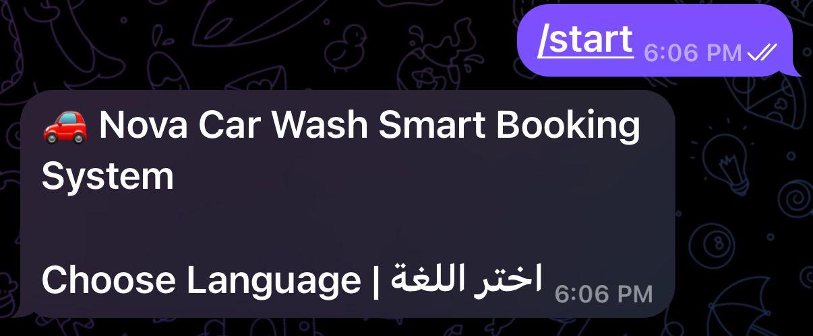
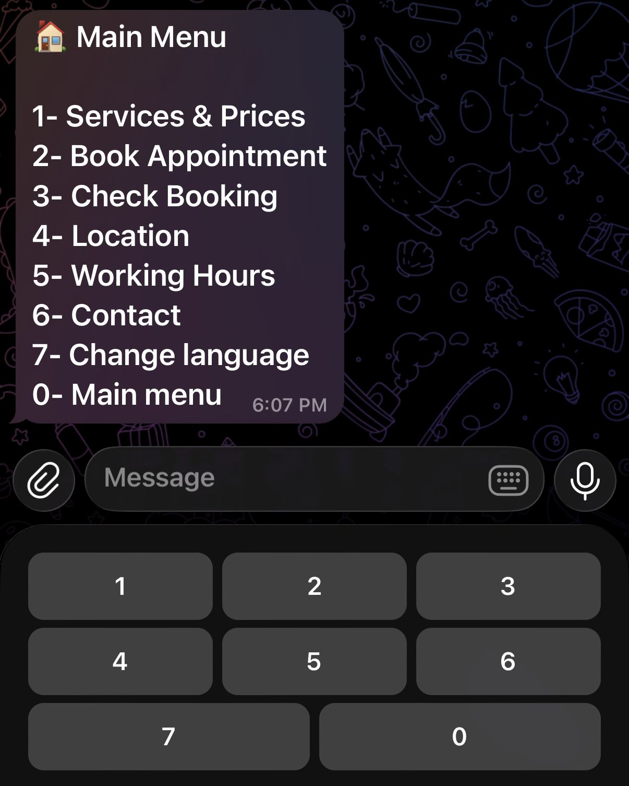
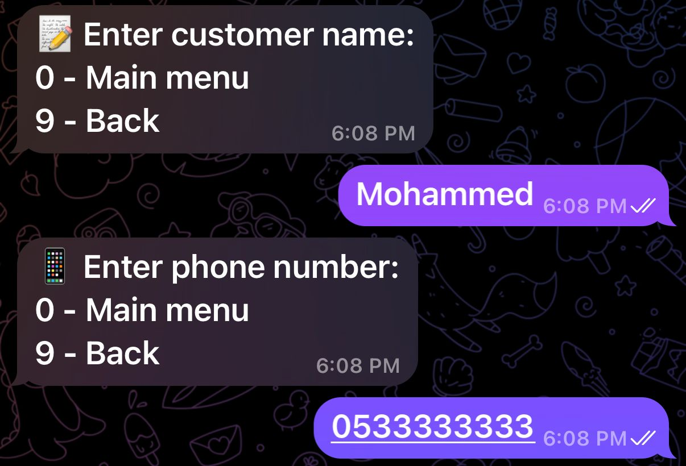
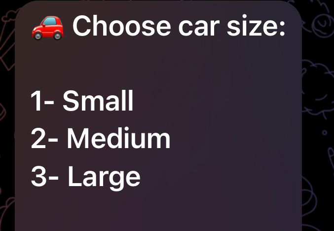
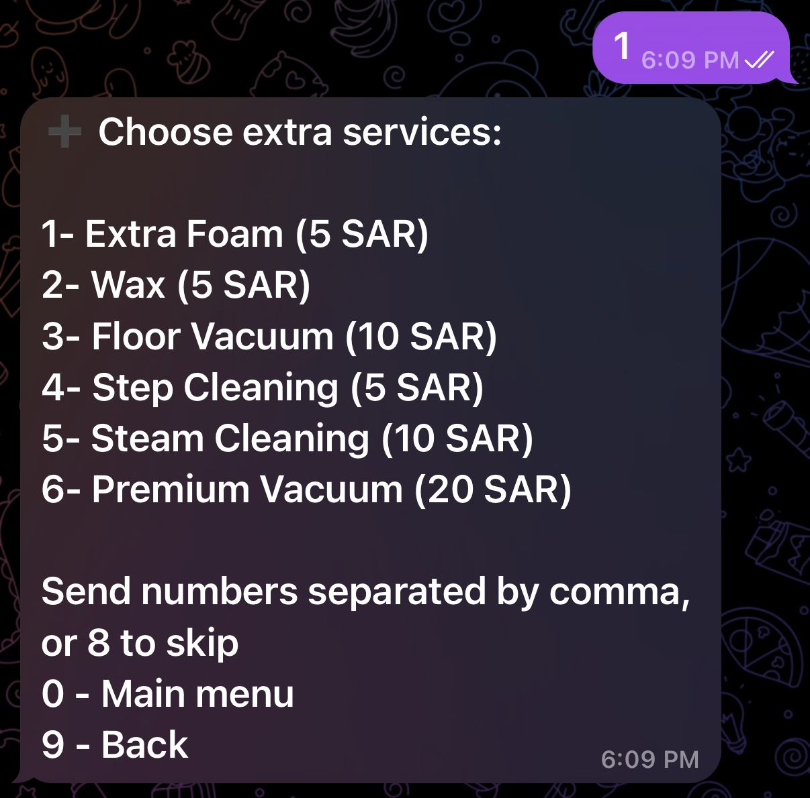
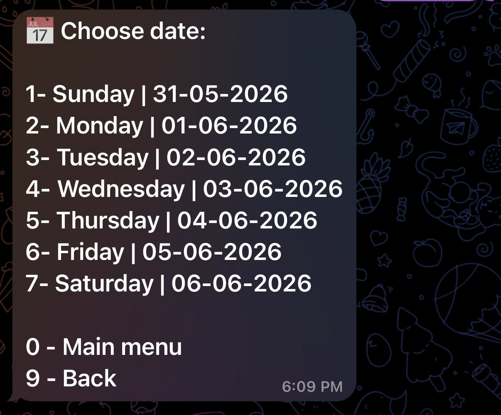
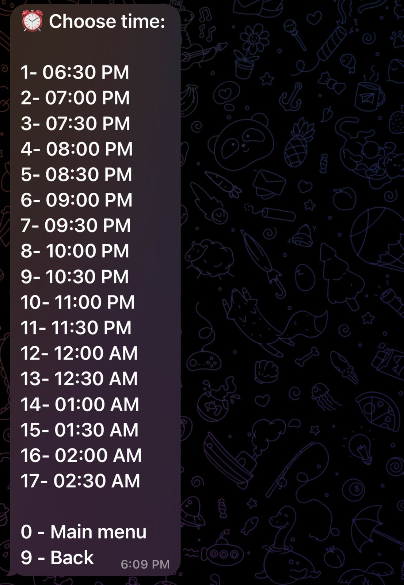
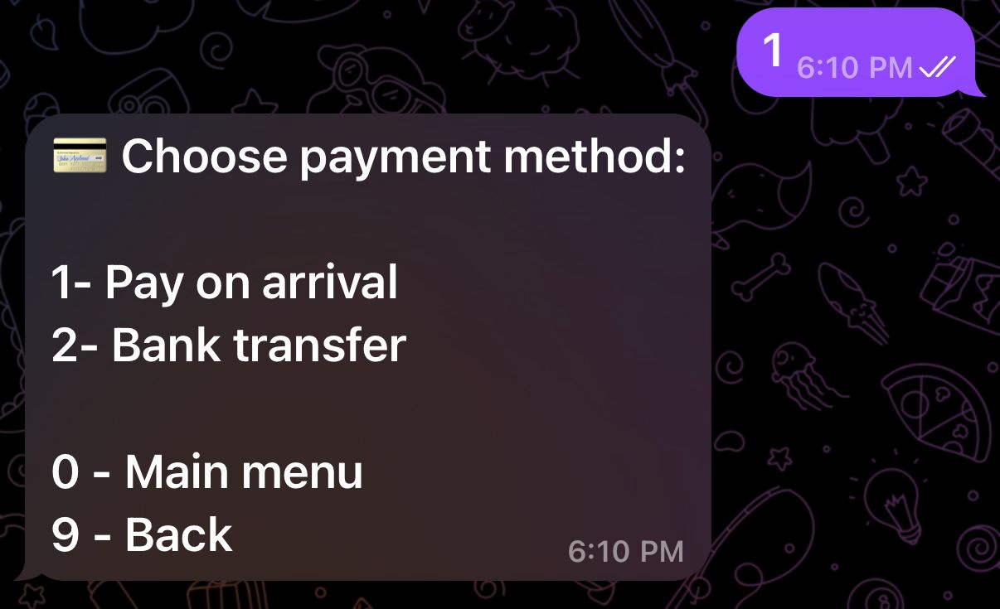
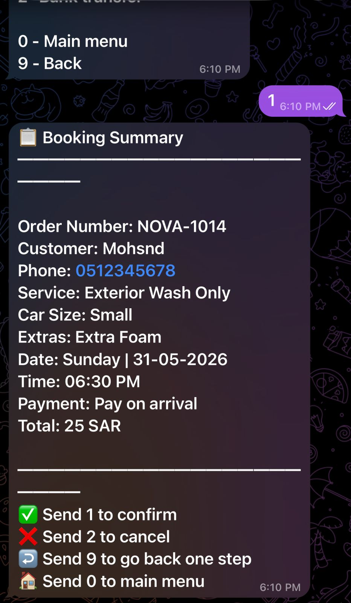
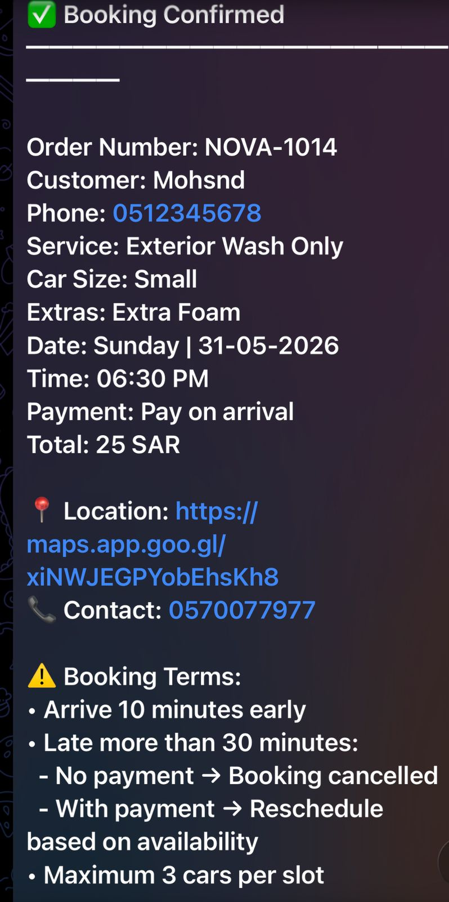

# 🚗 Telegram Car Wash Bot

A smart Telegram bot developed using Python to automate car wash bookings.

The system allows customers to:

- View services and prices
- Book appointments
- Select vehicle size
- Choose additional services
- Select date and time
- Choose payment method
- Receive booking confirmation

---

## 🛠 Technologies Used

- Python
- Telegram Bot API
- SQLite
- Object-Oriented Programming (OOP)

---

## ✨ Features

- Bilingual support (Arabic / English)
- Interactive menu system
- Appointment booking workflow
- Vehicle size selection
- Additional services selection
- Date & time scheduling
- Payment method selection
- Booking summary generation
- Booking confirmation system
- SQLite database integration

---

## 📂 Project Structure

```text
telegram-carwash-bot/
│
├── bot.py
├── database.py
├── services.py
├── main.py
├── assets/
│   └── screenshots/
└── README.md
```

---

## 📸 Screenshots

### Welcome Screen



### Main Menu



### Customer Information Input



### Car Size Selection



### Extra Services Selection



### Date Selection



### Time Selection



### Payment Method Selection



### Booking Summary



### Booking Confirmation



---

## 🎯 Learning Objectives

This project was developed for educational purposes to practice:

- Python programming
- Telegram Bot development
- Database management using SQLite
- Software design and architecture
- User interaction workflows
- Real-world booking system implementation

---

## 👨‍💻 Author

Mohammed Almehaish

Computer Engineering Student

Saudi Arabia
